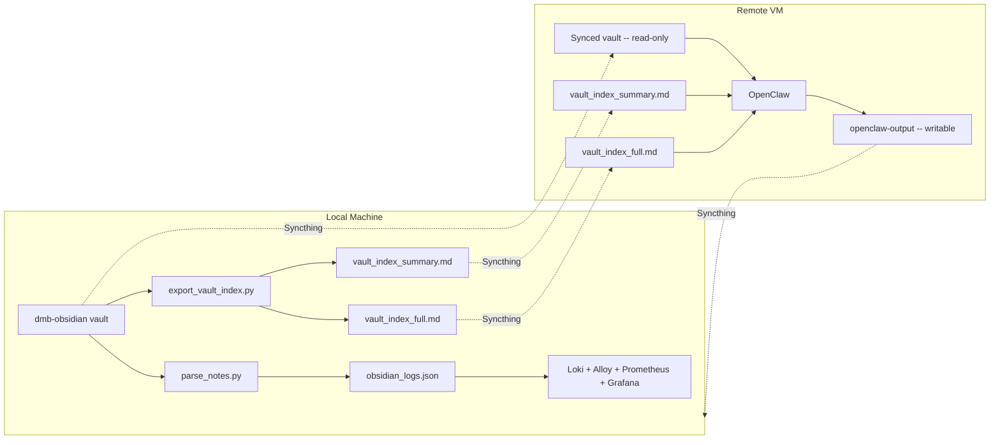

# OpenClaw + Obsidian Stack Integration

## Decision: Option A -- keep stack local, sync to VM

- Docker stack (Loki, Alloy, Prometheus, Grafana, metrics-exporter) stays local, unchanged.
- **Syncthing** syncs to the remote OpenClaw VM:
  - `dmb-obsidian` vault (read-only on VM)
  - Vault index files (read-only on VM)
- One writable Syncthing folder for OpenClaw output back to the local machine.
- **OpenClaw does all the reasoning**; the local machine only provides raw structural data.

---

## What to build

### 1. Vault index script (`export_vault_index.py`)

A script that produces **two Markdown files** for a 13K+ note vault:

**Inputs**: Directly scans the vault (reuses parsing logic from [parse_notes.py](parse_notes.py) -- `extract_basic_stats`, `extract_frontmatter_metadata`, `get_file_timestamps`).

**Computes** (global, requires full vault scan):

- **Backlinks**: Inverts `wikilinks` across all notes. For each note, which other notes link to it and how many.
- **Headings outline**: Extracts H1-H3 text from each note's body.
- **External URL count**: Counts `[text](url)` Markdown links per note.

**Per-note fields** (all fields, both tiers):

- `note_name`, `path` (relative to vault root)
- `word_count`
- `backlinks` (count), `backlinked_by` (list of note names)
- `outlinks` (count), `links_to` (list of note names)
- `tags` (frontmatter + inline)
- `frontmatter_status`, `frontmatter_type`, and other frontmatter fields
- `aliases` (from frontmatter)
- `created_at`, `modified_at`
- `headings` (H1-H3 text, e.g. "Intro > Background > Key Points")
- `external_url_count`

**No excerpts** -- OpenClaw has the full vault via Syncthing and can `memory_get` any note directly. The index provides structural/graph data only.

#### Output: Two files

**Tier 1: `vault_index_summary.md`** (~500 lines, fits in LLM context window)

```markdown
# Vault Index Summary
Generated: 2026-03-11T10:00:00Z | Vault: dmb-obsidian | Notes: 13,247 | Words: 2.1M | Tags: 1,843

## Most Backlinked Notes (top 50)
## Note Name
- **Path**: ... | **Words**: ... | **Backlinks**: ...
- **Tags**: ... | **Status**: ... | **Type**: ...
- ... (full metadata block)

## Linked But Underdeveloped (high backlinks, low word count, top 50)
(same block format)

## Recently Modified (top 50)
(same block format)

## Vault Breakdown
- By status: draft (342), published (1,204), ...
- By type: talk (45), npc (231), ...
- By top-level folder: Areas (2,100), Projects (800), ...
- Top 20 tags by usage
```

This is what OpenClaw reads first to orient itself.

**Tier 2: `vault_index_full.md`** (all 13K notes, searchable via `memory_search`)

Per-note blocks for every note, no excerpts:

```markdown
## Some Note Title
- **Path**: folder/some-note.md | **Words**: 450 | **Backlinks**: 12 | **Outlinks**: 5
- **Tags**: #topic1, #topic2 | **Status**: draft | **Type**: talk
- **Modified**: 2024-01-15 | **Created**: 2023-06-01 | **URLs**: 3
- **Links to**: [[Note A]], [[Note B]], [[Note C]]
- **Linked by**: [[Note X]], [[Note Y]], ... (12 notes)
- **Headings**: Introduction > Background > Key Points > Conclusion
- **Aliases**: ML, machine learning
```

Sorted by backlinks descending. Too large for a single context window read (~78K lines, ~650K tokens), but OpenClaw uses `memory_search` to find relevant sections.

### 2. Config updates ([config.yaml](config.yaml))

Add:

- `index_output_path`: Directory to write both index files (default: `./index/`, should point to Syncthing-synced folder)

### 3. Cron integration ([setup.sh](setup.sh))

Run the vault index script after the parser in the existing cron job. Same 5-minute schedule, or less frequent if the full scan is slow on 13K files (can be tuned).

### 4. Syncthing setup

Install and configure Syncthing on both machines:

**Local machine**:

- Install Syncthing (Homebrew: `brew install syncthing`)
- Share 3 folders:
  - `dmb-obsidian` vault -> VM (send-only)
  - `obsidian-index` (contains `vault_index_summary.md` + `vault_index_full.md`) -> VM (send-only)
  - `openclaw-output` <- VM (receive-only)

**Remote VM**:

- Install Syncthing
- Accept 3 folders:
  - `dmb-obsidian` vault (receive-only)
  - `obsidian-index` (receive-only)
  - `openclaw-output` (send-only, OpenClaw writes here)

**Security hardening** (remote VM):

- Syncthing encrypts all traffic (TLS) and authenticates via Ed25519 device IDs -- transport is secure
- Disable global discovery and relay servers; use static addresses for the VM
- Main risk is data at rest on VM -- standard hardening: SSH keys only, firewall, OS updates, minimal attack surface
- Vault and index are read-only from OpenClaw's perspective, limiting blast radius to data exposure only

### 5. Documentation

Add to README:

- Syncthing folder layout and setup steps
- How the two-tier index works
- Example OpenClaw questions and how they map to index + vault data
- Security considerations for remote VM

---

## Data flow



## How OpenClaw uses it

1. **Broad questions** ("What should I work on next?"): OpenClaw reads `vault_index_summary.md` (fits in context), sees top backlinked/underdeveloped/recent notes, then reasons about priorities.
2. **Specific queries** ("What notes mention distributed systems?"): OpenClaw uses `memory_search` over `vault_index_full.md` and/or the synced vault content.
3. **Deep review** ("Review my draft on X"): OpenClaw finds the note in the index, then `memory_get`s the actual file from the synced vault for full content.

---

## What this does NOT include (by design)

- **No precomputed recommendations**: OpenClaw decides what's important, not the script.
- **No excerpts in the index**: OpenClaw has the full vault via Syncthing for content access.
- **No Loki/Prometheus on the VM**: The stack stays local for dashboards.
- **No HTTP API**: File-based approach (Syncthing) is simpler and sufficient.
- **No Grafana Cloud migration**: Not needed for this use case.

## Production note

The index script will need to handle 13K+ files efficiently. Consider:

- Caching: Skip notes not modified since last index run (similar to `parse_notes.py`'s `.last_run` approach, but always regenerate the full index since backlink counts can change when ANY note changes)
- Timing: Profile the first run; if it takes >60s, consider running less frequently than every 5 minutes
