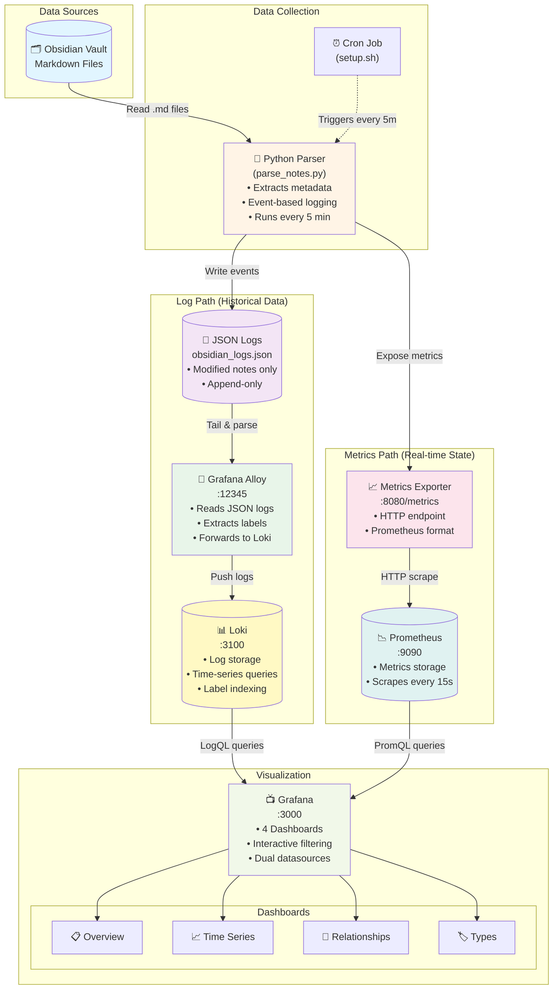

# Obsidian to Grafana Monitoring System

A comprehensive monitoring and analytics system for Obsidian vaults. Transform your Markdown notes into time-series metrics and interactive dashboards using industry-standard observability tools (Loki, Prometheus, Grafana, Alloy).

**What it does:**
- 📊 Tracks note statistics (word count, line count, file size) over time
- 🏷️ Analyzes tags, frontmatter fields, and metadata patterns
- 🔗 Visualizes note relationships through wikilinks
- 📈 Provides real-time metrics and historical trend analysis
- ⚡ Uses event-based logging to efficiently track only modified notes

**Why it's useful:**
- Understand your writing habits and vault growth patterns
- Monitor content organization and tagging consistency
- Identify highly connected notes and knowledge clusters
- Track progress on notes with specific frontmatter (status, priority, etc.)
- Gain insights into your personal knowledge management system

## Architecture

This system uses a dual-path architecture for comprehensive monitoring:


```mermaid
graph TB
    subgraph "Data Sources"
        Vault[("🗂️ Obsidian Vault<br/>Markdown Files")]
    end
    
    subgraph "Data Collection"
        Parser["📝 Python Parser<br/>(parse_notes.py)<br/>• Extracts metadata<br/>• Event-based logging<br/>• Runs every 5 min"]
        Cron["⏰ Cron Job<br/>(setup.sh)"]
    end
    
    subgraph "Log Path (Historical Data)"
        LogFile[("📄 JSON Logs<br/>obsidian_logs.json<br/>• Modified notes only<br/>• Append-only")]
        Alloy["🔄 Grafana Alloy<br/>:12345<br/>• Reads JSON logs<br/>• Extracts labels<br/>• Forwards to Loki"]
        Loki[("📊 Loki<br/>:3100<br/>• Log storage<br/>• Time-series queries<br/>• Label indexing")]
    end
    
    subgraph "Metrics Path (Real-time State)"
        MetricsExp["📈 Metrics Exporter<br/>:8080/metrics<br/>• HTTP endpoint<br/>• Prometheus format"]
        Prometheus[("📉 Prometheus<br/>:9090<br/>• Metrics storage<br/>• Scrapes every 15s")]
    end
    
    subgraph "Visualization"
        Grafana["📺 Grafana<br/>:3000<br/>• 4 Dashboards<br/>• Interactive filtering<br/>• Dual datasources"]
        
        subgraph "Dashboards"
            D1["📋 Overview"]
            D2["📈 Time Series"]
            D3["🔗 Relationships"]
            D4["🏷️ Types"]
        end
    end
    
    Vault -->|Read .md files| Parser
    Cron -.->|Triggers every 5m| Parser
    
    Parser -->|Write events| LogFile
    Parser -->|Expose metrics| MetricsExp
    
    LogFile -->|Tail & parse| Alloy
    Alloy -->|Push logs| Loki
    
    MetricsExp -->|HTTP scrape| Prometheus
    
    Loki -->|LogQL queries| Grafana
    Prometheus -->|PromQL queries| Grafana
    
    Grafana --> D1
    Grafana --> D2
    Grafana --> D3
    Grafana --> D4
    
    style Vault fill:#e1f5ff
    style Parser fill:#fff4e6
    style LogFile fill:#f3e5f5
    style Alloy fill:#e8f5e9
    style Loki fill:#fff9c4
    style MetricsExp fill:#fce4ec
    style Prometheus fill:#e0f2f1
    style Grafana fill:#f1f8e9
```

### Data Flow

**Path 1: Log-Based (Event Tracking)**
1. **Python Parser** extracts metadata from all `.md` files in the Obsidian vault
2. Parser checks last run timestamp and only processes **modified notes** (event-based)
3. Structured JSON entries are **appended** to `obsidian_logs.json`
4. **Alloy** tails the log file, parses JSON, and extracts labels (vault, tags, frontmatter fields)
5. **Loki** stores log entries with labels for efficient querying
6. **Grafana** queries Loki using LogQL to display historical trends and relationships

**Path 2: Metrics-Based (Current State)**
1. **Metrics Exporter** service runs the parser in metrics-only mode
2. Parser scans the entire vault and updates **Prometheus metrics**
3. Metrics are exposed via HTTP endpoint at `:8080/metrics`
4. **Prometheus** scrapes metrics every 15 seconds
5. **Grafana** queries Prometheus using PromQL for real-time statistics

### Components

| Component | Purpose | Port | Technology |
|-----------|---------|------|------------|
| Python Parser | Metadata extraction and metrics generation | N/A | Python 3, frontmatter, PyYAML |
| Cron Job | Scheduled execution (every 5 minutes) | N/A | System cron |
| Alloy | Log collection and forwarding | 12345 | Grafana Alloy |
| Loki | Log storage and querying | 3100 | Grafana Loki 3.0 |
| Prometheus | Metrics storage and TSDB | 9090 | Prometheus |
| Metrics Exporter | Prometheus metrics endpoint | 8080 | Python + prometheus_client |
| Grafana | Visualization and dashboards | 3000 | Grafana 11.6 |
| Grafana Assistant | AI assistant plugin (manually installed) | — | grafana-assistant-app v1.1.52 |

**Key Features:**
- 🔄 **Event-Based Logging**: Only modified notes are logged, reducing storage by 90%+
- 📊 **Dual Data Sources**: Combines historical logs (Loki) with real-time metrics (Prometheus)
- 🏷️ **Label-Based Indexing**: Frontmatter fields become Loki labels for fast filtering
- 🐳 **Containerized**: All services run in Docker with docker-compose
- ⚡ **Efficient**: Incremental parsing with timestamp tracking

## Features

### Data Collection
- **Basic Statistics**: Tracks word count, line count, character count, and file size for every note
- **Frontmatter Extraction**: Parses all YAML frontmatter fields (status, category, priority, type, etc.)
- **Tag Tracking**: Captures both frontmatter `tags` arrays and inline `#hashtags`
- **Wikilink Detection**: Identifies `[[note]]` references for relationship mapping
- **File Timestamps**: Records creation and modification times for each note
- **Event-Based Logging**: Only logs notes modified since last run, reducing storage and processing overhead

### Monitoring & Metrics
- **Prometheus Metrics**: Real-time metrics exposed via HTTP endpoint
  - Total note count per vault
  - Total word count across all notes
  - Unique tag count
  - Total wikilink count
- **Automatic Log Rotation**: Rotates logs when they exceed 50MB to manage disk space
- **Scheduled Parsing**: Automated cron job runs every 5 minutes to capture changes

### Visualization
Four pre-configured Grafana dashboards:

1. **Overview Dashboard**: High-level vault statistics, processing rate, and recent activity
2. **Time Series Dashboard**: Individual note metrics tracked over time with filtering
3. **Relationships Dashboard**: Wikilink network analysis and backlink visualization
4. **Types Dashboard**: Distribution and patterns of frontmatter types (e.g., NPC, PC, audio)

**Interactive Filtering**: All dashboards support filtering by vault, tags, categories, note names, and frontmatter fields

### Technical Features
- **Containerized Deployment**: All services run in Docker with docker-compose
- **YAML Configuration**: Simple config file for easy customization
- **Dual Data Paths**: Combines log-based event tracking with real-time metrics
- **Label-Based Indexing**: Frontmatter fields become Loki labels for efficient querying
- **Hidden File Exclusion**: Automatically skips hidden files and `.` directories

## Quick Start

### 1. Set Up Configuration

First, copy the example configuration file and customize it for your setup:

```bash
cp config.yaml.example config.yaml
```

Then edit `config.yaml` and update the values:

```yaml
vault_path: "/path/to/your/obsidian/vault"  # Update this to your actual vault path
output_file: "./logs/obsidian_logs.json"
log_level: "INFO"  # Options: DEBUG, INFO, WARNING, ERROR
metrics_port: 8080
start_metrics_server: false  # Set to true to enable metrics collection
grafana_password: "your_grafana_password_here"  # Replace with your actual Grafana password
```

**Important**: The `config.yaml` file contains sensitive information (like your Grafana password) and is excluded from version control. Always use the `config.yaml.example` file as a template.

Also create a `.env` file for Docker Compose (so `docker compose` commands work without needing `setup.sh`):

```bash
cp .env.example .env
```

Then edit `.env` and set your vault path:

```bash
VAULT_PATH="/path/to/your/obsidian/vault"
```

### 2. Install Python Dependencies

```bash
pip3 install -r requirements.txt
```

### 3. Start the System

Run the setup script to start everything:

```bash
./setup.sh
```

This will:
- Read the Grafana password from `config.yaml`
- Start all Docker containers
- Set up automated parsing every 5 minutes
- Display access URLs and credentials

Services available at:
- **Grafana** at http://localhost:3000 (admin/your_password)
- **Loki** at http://localhost:3100
- **Alloy** at http://localhost:12345
- **Prometheus** at http://localhost:9090
- **Metrics Exporter** at http://localhost:8080

The parser will run every 5 minutes automatically.

### Grafana Assistant Plugin

The [Grafana Assistant](https://grafana.com/grafana/plugins/grafana-assistant-app/) plugin is installed manually into the Grafana Docker volume. Plugin ZIPs are stored locally in `grafana/plugins/` (gitignored).

To install or update the plugin:

```bash
# Remove the old version from the Docker volume
docker run --rm -v obsidian-grafana_grafana_data:/data alpine rm -rf /data/plugins/grafana-assistant-app

# Install the new version from a ZIP
docker run --rm \
  -v obsidian-grafana_grafana_data:/data \
  -v ./grafana/plugins/YOUR_PLUGIN.zip:/tmp/plugin.zip \
  alpine sh -c "apk add --no-cache unzip && unzip /tmp/plugin.zip -d /data/plugins/"

# Restart Grafana to load the new plugin
docker restart obsidian-grafana
```

**Current version:** grafana-assistant-app v1.1.52

### 4. Test the System

Run the parser manually to generate initial data:

```bash
python3 parse_notes.py
```

Check that logs are being generated:

```bash
tail -f /tmp/obsidian_logs.json
```

### 5. View Dashboards

Open Grafana at http://localhost:3000 and explore the pre-configured dashboards:

- **Obsidian Overview**: High-level vault statistics and recent activity
- **Time Series**: Word count, line count, and file size trends over time
- **Note Relationships**: Wikilinks and backlink analysis
- **Frontmatter Types**: Distribution and usage patterns of different frontmatter types

## Saving Dashboard Changes

Dashboards are provisioned from JSON files in `grafana/dashboards/`. If you edit a dashboard in the Grafana UI, those changes are saved only to Grafana's internal database — **not** back to the JSON files. This means UI changes won't be included when you `git push`.

To solve this, a pre-commit hook automatically exports the latest dashboard JSON from Grafana before each commit.

### Setup (one-time)

Configure git to use the project's hooks directory:

```bash
git config core.hooksPath .githooks
```

This requires `jq` to be installed:

```bash
brew install jq        # macOS
sudo apt install jq    # Debian/Ubuntu
```

### How it works

1. You edit dashboards in the Grafana UI as normal
2. When you `git commit`, the pre-commit hook checks if Grafana is running
3. If running, it exports all dashboards via the API and overwrites the JSON files in `grafana/dashboards/`
4. Any changes are automatically staged into the commit
5. If Grafana isn't running, the hook silently skips (so commits still work offline)

### Manual export

You can also export dashboards manually at any time:

```bash
./scripts/export-dashboards.sh
```

The script accepts environment variables for non-default setups:

| Variable | Default | Description |
|---|---|---|
| `GRAFANA_URL` | `http://localhost:3000` | Grafana base URL |
| `GRAFANA_USER` | `admin` | API username |
| `GRAFANA_PASSWORD` | `admin` | API password (falls back to `GF_SECURITY_ADMIN_PASSWORD`) |

## Manual Usage

### Run Parser Manually

```bash
# Using config file
python3 parse_notes.py

# Override vault path
python3 parse_notes.py --vault-path /path/to/vault

# Override output file
python3 parse_notes.py --output /tmp/custom_logs.json

# Set log level
python3 parse_notes.py --log-level DEBUG
```

### View Alloy Status

Visit http://localhost:12345 to see Alloy's status and configuration.

## Dashboard Queries

The dashboards use LogQL queries to filter and aggregate data. See `.cursor/plan.md` for detailed query examples and implementation details.

## Configuration

### Python Parser (`parse_notes.py`)

The parser extracts comprehensive metadata from each note:

**Extracted Fields:**
- **Basic Stats**: `word_count`, `line_count`, `char_count`, `file_size`
- **Timestamps**: `created_at`, `modified_at` (with internal timestamp tracking for event-based logging)
- **Frontmatter**: All YAML frontmatter fields exported as `frontmatter_*` labels
  - Supports strings, numbers, booleans, and lists (lists are comma-separated)
  - Common fields: `frontmatter_status`, `frontmatter_category`, `frontmatter_priority`, `frontmatter_type`
- **Tags**: 
  - `tags`: Frontmatter tags (from YAML array)
  - `inline_tags`: Inline `#hashtags` extracted via regex
- **Wikilinks**: `[[note]]` references parsed and stored for relationship analysis
- **File Info**: `note_name`, `file_path` (relative to vault root)

**Event-Based Logging:**
- Tracks last run timestamp in `.last_run` file
- Only processes notes modified since last run
- Reduces log volume and processing time for large vaults

**Configuration Options:**
```yaml
vault_path: "/path/to/vault"        # Required: Path to Obsidian vault
output_file: "./logs/obsidian_logs.json"  # Where to write log entries
log_level: "INFO"                   # DEBUG, INFO, WARNING, ERROR
metrics_port: 8080                  # Prometheus metrics endpoint port
start_metrics_server: false         # Enable/disable metrics server
grafana_password: "admin"           # Grafana admin password

# Files to exclude from parsing (matched against note filename without extension)
exclude_files:
  - "Changelog"
```

The `exclude_files` list skips notes by filename (without `.md` extension). Use this for extremely large notes that exceed Loki's `max_line_size` or that don't need monitoring.

### Alloy Configuration

Alloy serves as the log collector and forwarder:

**Monitored Files:**
- `obsidian_logs.json`: Structured JSON log entries from parser
- `obsidian_parser.log`: Parser execution logs (for debugging)

**Processing Pipeline:**
1. Reads log files via `loki.source.file` (positions persisted in `alloy_data` volume)
2. Parses JSON and extracts labels via `loki.process`
3. Parses the entry timestamp using RFC3339Nano format (preserves original event time)
4. Converts frontmatter fields to Loki labels (vault, job, tags, frontmatter_*)
5. Forwards to Loki via `loki.write`

**Label Extraction:**
- `vault`: Vault name (from vault path)
- `job`: Always `obsidian-parser`
- `tags`: Comma-separated frontmatter tags
- `frontmatter_*`: All frontmatter fields as individual labels

### Grafana Dashboards

Four pre-configured dashboards are automatically provisioned:

1. **Overview (`overview.json`)**: 
   - Total notes count
   - Processing rate and throughput
   - Recent activity timeline
   - Vault-level statistics

2. **Time Series (`timeseries.json`)**: 
   - Individual note metrics over time
   - Word count, line count, file size trends
   - Filtering by note name, tags, categories

3. **Relationships (`relationships.json`)**: 
   - Wikilink network visualization
   - Backlink analysis
   - Note connection patterns

4. **Frontmatter Types (`types.json`)**: 
   - Distribution of frontmatter types (NPC, PC, audio, etc.)
   - Type usage patterns over time
   - Pie charts and time series by type

**Data Sources:**
- **Loki**: For log-based queries and event tracking
- **Prometheus**: For real-time metrics and current state

## Troubleshooting

### Parser Issues

```bash
# Check parser logs
tail -f ./logs/obsidian_parser.log

# Run with debug logging
python3 parse_notes.py --log-level DEBUG

# Verify JSON logs are being created
tail -f ./logs/obsidian_logs.json

# Check last run timestamp
cat ./logs/.last_run
```

**Common Issues:**
- **"Vault path does not exist"**: Ensure `vault_path` in `config.yaml` is correct
- **No logs generated**: Check file permissions on the `logs/` directory
- **Frontmatter not parsing**: Ensure YAML frontmatter is valid and uses `---` delimiters

### Docker Issues

```bash
# Check container status
docker-compose ps

# View all logs
docker-compose logs -f

# View specific service logs
docker-compose logs -f grafana
docker-compose logs -f loki
docker-compose logs -f alloy
docker-compose logs -f metrics-exporter

# Restart specific service
docker-compose restart grafana

# Restart all services
docker-compose restart

# Rebuild after code changes
docker-compose up -d --build
```

### Alloy Issues

- Visit http://localhost:12345 for Alloy UI and status
- Check that `./logs/obsidian_logs.json` is being created and populated
- Verify Loki connectivity in Alloy logs: `docker compose logs alloy`
- Ensure log files are mounted correctly in the container
- Alloy stores file read positions in the `alloy_data` Docker volume — if this is lost, Alloy re-reads files from the beginning, which may cause duplicate entries in Loki

### Loki Issues

```bash
# Check Loki is receiving logs
curl http://localhost:3100/ready

# Query Loki directly
curl -G http://localhost:3100/loki/api/v1/query \
  --data-urlencode 'query={job="obsidian-parser"}' \
  --data-urlencode 'limit=10'
```

### Prometheus Issues

- Visit http://localhost:9090 to access Prometheus UI
- Check targets at http://localhost:9090/targets to ensure metrics-exporter is UP
- Verify metrics endpoint: `curl http://localhost:8080/metrics`

### Grafana Issues

- **Datasources**: Check configuration at http://localhost:3000/datasources
- **No data in dashboards**: 
  - Verify Loki has data: use Explore view with query `{job="obsidian-parser"}`
  - Check time range in dashboard (default is last 6 hours)
  - Ensure parser has run at least once
- **Authentication issues**: Check `GRAFANA_PASSWORD` in docker-compose or use default `admin/admin`

## File Structure

```
obsidian-grafana/
├── parse_notes.py                      # Main Python parser script
├── requirements.txt                    # Python dependencies (pyyaml, frontmatter, prometheus-client)
├── config.yaml                         # User configuration (git-ignored)
├── config.yaml.example                 # Configuration template
├── setup.sh                            # Setup script (starts Docker + cron)
├── docker-compose.yml                  # Docker stack orchestration
├── Dockerfile                          # Dockerfile for metrics exporter service
├── README.md                           # Documentation (this file)
│
├── scripts/
│   └── export-dashboards.sh           # Export Grafana dashboards to JSON files
├── .githooks/
│   └── pre-commit                     # Auto-exports dashboards before commits
│
├── alloy/
│   └── config.alloy                    # Alloy log collection configuration
│
├── grafana/
│   ├── provisioning/
│   │   ├── dashboards/
│   │   │   └── dashboards.yml          # Dashboard provisioning config
│   │   └── datasources/
│   │       ├── loki.yml                # Loki datasource configuration
│   │       └── prometheus.yml          # Prometheus datasource configuration
│   └── dashboards/
│       ├── overview.json               # Overview dashboard
│       ├── timeseries.json             # Time series dashboard
│       ├── relationships.json          # Relationships dashboard
│       └── types.json                  # Frontmatter types dashboard
│
├── logs/                               # Generated logs directory
│   ├── obsidian_logs.json             # Structured log entries (appended)
│   ├── obsidian_parser.log            # Parser execution logs
│   └── .last_run                       # Last run timestamp for event-based logging
│
├── loki-config.yaml                    # Loki storage and limits configuration
└── prometheus.yml                      # Prometheus scrape configuration
```

**Generated Files:**
- `logs/obsidian_logs.json`: Append-only log file with note metadata
- `logs/obsidian_parser.log`: Parser execution logs (from cron)
- `logs/.last_run`: Timestamp of last successful parser run

**Docker Volumes:**
- `loki_data`: Loki log storage and indexes
- `grafana_data`: Grafana dashboards, preferences, and plugins
- `alloy_data`: Alloy's file read positions (tracks ingestion progress)

## Production Considerations

This setup is optimized for personal use and local development. For production or multi-user deployments, consider:

### Security
- Change default Grafana password via `GRAFANA_PASSWORD` environment variable
- Enable HTTPS/TLS for all web interfaces (Grafana, Prometheus, Alloy)
- Use Docker secrets instead of plain-text config files for credentials
- Implement authentication for Prometheus and Loki endpoints
- Restrict network access using firewall rules or Docker network policies

### Performance & Scaling
- **Event-Based Logging**: Already implemented to reduce log volume
- **Log Rotation**: Automatic rotation at 50MB; adjust `max_file_size` in parser if needed
- **Loki Retention**: Configure retention policies in `loki-config.yaml` for long-term storage
- **Prometheus Retention**: Adjust `--storage.tsdb.retention.time` in `docker-compose.yml`
- **Parser Schedule**: Adjust cron frequency based on vault size and update frequency
- **Label Cardinality**: Monitor Loki label cardinality; reduce frontmatter labels if needed

### Data Persistence
- Three Docker volumes persist data across container restarts:
  - `loki_data`: All log data stored in Loki
  - `grafana_data`: Dashboards, preferences, and plugin data
  - `alloy_data`: Alloy's file read positions (tracks where it left off in log files)
- Back up these volumes regularly: `docker run --rm -v loki_data:/data -v $(pwd):/backup ubuntu tar czf /backup/loki_data_backup.tar.gz -C /data .`
- Consider external storage (NFS, S3) for long-term archival
- **Do not use `docker compose down -v`** unless you intend to reset everything — the `-v` flag deletes all volumes, including Alloy's positions and Loki's stored data

### Downtime & Data Gaps

The cron-based parser runs on the host and continues writing to `obsidian_logs.json` even when Docker is down. When Alloy restarts, it resumes from its saved position in the file and sends any missed entries to Loki.

**Requirements for seamless recovery:**
- The `alloy_data` volume must survive the restart (avoid `docker compose down -v`)
- Entries must not be older than `reject_old_samples_max_age` (currently 744h / 31 days) in `loki-config.yaml`

**If Docker is down for longer than 31 days**, Loki will reject the oldest entries. To recover:

1. Stop Loki and Alloy: `docker compose stop loki alloy`
2. Remove their containers and volumes: `docker compose rm -f loki alloy && docker volume rm obsidian-grafana_loki_data obsidian-grafana_alloy_data`
3. Temporarily increase `reject_old_samples_max_age` and add `max_chunk_age` in `loki-config.yaml`:
   ```yaml
   ingester:
     max_chunk_age: 87600h
     chunk_idle_period: 87600h
   limits_config:
     reject_old_samples_max_age: 87600h
   ```
4. Start fresh: `docker compose up -d loki && sleep 5 && docker compose up -d alloy`
5. Wait for Alloy to finish re-ingesting (check `docker compose logs alloy` for errors)
6. Revert `loki-config.yaml` to normal values and restart Loki: `docker compose restart loki`

### Monitoring & Reliability
- Add health checks to `docker-compose.yml` for all services
- Configure Grafana alerting for parser failures or data gaps
- Monitor disk space for log files and Docker volumes
- Set up log aggregation for cron job failures

### Multi-Vault Support
- Parser already supports multiple vaults via `vault` label
- Run separate parser instances with different `config.yaml` files
- All vaults can share the same Loki/Grafana infrastructure

## OpenClaw Integration

This system can feed an [OpenClaw](https://docs.openclaw.ai) agent with structured vault data so it can answer questions like "What should I work on next?" or "Which notes are linked to but not fleshed out?"

### How It Works

The `export_vault_index.py` script scans the vault and produces two Markdown files:

- **`vault_index_summary.md`** (~500 lines): Top 50 most-backlinked notes, top 50 underdeveloped notes, recent modifications, and vault breakdown by status/type/folder/tags. Fits in an LLM context window.
- **`vault_index_full.md`** (all notes): Per-note metadata block for every note in the vault, sorted by backlink count. Searchable via `memory_search`.

OpenClaw does all the reasoning — the index provides raw structural data only (backlinks, word counts, tags, headings, etc.), not precomputed recommendations.

### Per-Note Metadata

Each note block in the index includes:

- Note name, relative path, word count
- Backlink count and list (which notes link TO this note)
- Outbound wikilinks list
- Tags (frontmatter + inline)
- Frontmatter fields (status, type, category, etc.)
- Aliases
- Creation and modification dates
- Heading outline (H1-H3)
- External URL count

### Running the Index Generator

```bash
# Using config.yaml (reads vault_path and index_output_path)
python3 export_vault_index.py

# Override vault path
python3 export_vault_index.py --vault-path /path/to/vault

# Override output directory
python3 export_vault_index.py --output-dir /path/to/syncthing/folder

# Debug logging
python3 export_vault_index.py --log-level DEBUG
```

The index runs automatically every 5 minutes via the cron job set up by `setup.sh`.

### Syncthing Setup

[Syncthing](https://syncthing.net/) syncs the vault and index files to the OpenClaw VM. The index files are kept **outside** the vault (to avoid Obsidian trying to index them) in a sibling directory.

**Local machine:**

| Folder | Path | Direction |
|--------|------|-----------|
| `dmb-obsidian` | Your vault directory | Send-only |
| `openclaw-index` | `index_output_path` from config (e.g. `DownloadMyBrain/openclaw-index/`) | Send-only |
| `openclaw-output` | Local folder for OpenClaw responses | Receive-only |

**Remote VM (OpenClaw):**

| Folder | Path | Direction |
|--------|------|-----------|
| `dmb-obsidian` | VM vault directory | Receive-only |
| `openclaw-index` | VM index directory | Receive-only |
| `openclaw-output` | OpenClaw writable folder | Send-only |

**Setup steps:**

1. Install Syncthing on both machines:
   - macOS: `brew install syncthing`
   - Linux: `sudo apt install syncthing` or see [syncthing.net/downloads](https://syncthing.net/downloads/)
2. Start Syncthing on both machines and note the device IDs
3. Add each device as a remote on the other machine
4. Share the three folders with the directions shown above
5. Set `index_output_path` in `config.yaml` to a directory outside the vault (e.g. a sibling folder)

**Security hardening (recommended for remote VMs):**

- Disable global discovery: Settings > Connections > uncheck "Global Discovery"
- Disable relays: Settings > Connections > uncheck "Enable Relaying"
- Use static addresses: Add the VM's IP:port as a device address instead of `dynamic`
- Syncthing encrypts all traffic (TLS) and authenticates via Ed25519 device IDs
- Main risk is data at rest on the VM — apply standard hardening (SSH keys only, firewall, OS updates)

### Example OpenClaw Questions

Once the vault and index are synced, OpenClaw can answer:

- **"What should I work on next?"** — reads `vault_index_summary.md`, sees top backlinked/underdeveloped notes, reasons about priorities
- **"Which notes are linked to but not fleshed out?"** — looks at the "Linked But Underdeveloped" section in the summary
- **"Review my draft on [topic]"** — finds the note in the index, then reads the actual file from the synced vault
- **"What notes mention [topic]?"** — uses `memory_search` over the full index and/or vault content
- **"What are my most connected ideas?"** — reads the "Most Backlinked Notes" section

## Contributing

Contributions are welcome! Here are some ideas for enhancements:

### Parser Enhancements
- Support for additional frontmatter types and custom fields
- Dataview field extraction (inline fields like `field:: value`)
- Image and attachment tracking
- Daily note pattern detection
- Metadata caching for faster incremental parsing

### Visualization Improvements
- Network graph visualization for wikilink relationships
- Heatmap of writing activity by time of day/week
- Note similarity clustering
- Tag co-occurrence analysis
- Word cloud dashboards

### Integration Features
- Webhook support for real-time updates
- API endpoint for external integrations
- Obsidian plugin for direct integration
- Export capabilities (CSV, JSON, etc.)
- Multi-vault comparison views

### Infrastructure
- Kubernetes deployment manifests
- CI/CD pipeline examples
- Automated backup scripts
- Performance benchmarking tools

To contribute, please open an issue to discuss your idea before submitting a pull request.

## License

This project is open source. Feel free to modify and distribute as needed.
