# Obsidian to Grafana Monitoring System

A comprehensive monitoring and analytics system for Obsidian vaults. Transform your Markdown notes into time-series metrics and interactive dashboards using industry-standard observability tools (Loki, Prometheus, Grafana, Alloy).

**What it does:**
- 📊 Tracks note statistics (word count, line count, file size) over time
- 🏷️ Analyzes tags, frontmatter fields, and metadata patterns
- 🔗 Visualizes note relationships through wikilinks
- 📈 Provides real-time metrics and historical trend analysis
- ⚡ Uses event-based logging to efficiently track only modified notes

**Why it's useful:**
- Understand your writing habits and vault growth patterns
- Monitor content organization and tagging consistency
- Identify highly connected notes and knowledge clusters
- Track progress on notes with specific frontmatter (status, priority, etc.)
- Gain insights into your personal knowledge management system

## Architecture

This system uses a dual-path architecture for comprehensive monitoring:

```mermaid
graph TB
    subgraph "Data Sources"
        Vault[("🗂️ Obsidian Vault<br/>Markdown Files")]
    end
    
    subgraph "Data Collection"
        Parser["📝 Python Parser<br/>(parse_notes.py)<br/>• Extracts metadata<br/>• Event-based logging<br/>• Runs every 5 min"]
        Cron["⏰ Cron Job<br/>(setup.sh)"]
    end
    
    subgraph "Log Path (Historical Data)"
        LogFile[("📄 JSON Logs<br/>obsidian_logs.json<br/>• Modified notes only<br/>• Append-only")]
        Alloy["🔄 Grafana Alloy<br/>:12345<br/>• Reads JSON logs<br/>• Extracts labels<br/>• Forwards to Loki"]
        Loki[("📊 Loki<br/>:3100<br/>• Log storage<br/>• Time-series queries<br/>• Label indexing")]
    end
    
    subgraph "Metrics Path (Real-time State)"
        MetricsExp["📈 Metrics Exporter<br/>:8080/metrics<br/>• HTTP endpoint<br/>• Prometheus format"]
        Prometheus[("📉 Prometheus<br/>:9090<br/>• Metrics storage<br/>• Scrapes every 15s")]
    end
    
    subgraph "Visualization"
        Grafana["📺 Grafana<br/>:3000<br/>• 4 Dashboards<br/>• Interactive filtering<br/>• Dual datasources"]
        
        subgraph "Dashboards"
            D1["📋 Overview"]
            D2["📈 Time Series"]
            D3["🔗 Relationships"]
            D4["🏷️ Types"]
        end
    end
    
    Vault -->|Read .md files| Parser
    Cron -.->|Triggers every 5m| Parser
    
    Parser -->|Write events| LogFile
    Parser -->|Expose metrics| MetricsExp
    
    LogFile -->|Tail & parse| Alloy
    Alloy -->|Push logs| Loki
    
    MetricsExp -->|HTTP scrape| Prometheus
    
    Loki -->|LogQL queries| Grafana
    Prometheus -->|PromQL queries| Grafana
    
    Grafana --> D1
    Grafana --> D2
    Grafana --> D3
    Grafana --> D4
    
    style Vault fill:#e1f5ff
    style Parser fill:#fff4e6
    style LogFile fill:#f3e5f5
    style Alloy fill:#e8f5e9
    style Loki fill:#fff9c4
    style MetricsExp fill:#fce4ec
    style Prometheus fill:#e0f2f1
    style Grafana fill:#f1f8e9
```



### Data Flow

**Path 1: Log-Based (Event Tracking)**
1. **Python Parser** extracts metadata from all `.md` files in the Obsidian vault
2. Parser checks last run timestamp and only processes **modified notes** (event-based)
3. Structured JSON entries are **appended** to `obsidian_logs.json`
4. **Alloy** tails the log file, parses JSON, and extracts labels (vault, tags, frontmatter fields)
5. **Loki** stores log entries with labels for efficient querying
6. **Grafana** queries Loki using LogQL to display historical trends and relationships

**Path 2: Metrics-Based (Current State)**
1. **Metrics Exporter** service runs the parser in metrics-only mode
2. Parser scans the entire vault and updates **Prometheus metrics**
3. Metrics are exposed via HTTP endpoint at `:8080/metrics`
4. **Prometheus** scrapes metrics every 15 seconds
5. **Grafana** queries Prometheus using PromQL for real-time statistics

### Components

| Component | Purpose | Port | Technology |
|-----------|---------|------|------------|
| Python Parser | Metadata extraction and metrics generation | N/A | Python 3, frontmatter, PyYAML |
| Cron Job | Scheduled execution (every 5 minutes) | N/A | System cron |
| Alloy | Log collection and forwarding | 12345 | Grafana Alloy |
| Loki | Log storage and querying | 3100 | Grafana Loki 3.0 |
| Prometheus | Metrics storage and TSDB | 9090 | Prometheus |
| Metrics Exporter | Prometheus metrics endpoint | 8080 | Python + prometheus_client |
| Grafana | Visualization and dashboards | 3000 | Grafana 11.6 |

**Key Features:**
- 🔄 **Event-Based Logging**: Only modified notes are logged, reducing storage by 90%+
- 📊 **Dual Data Sources**: Combines historical logs (Loki) with real-time metrics (Prometheus)
- 🏷️ **Label-Based Indexing**: Frontmatter fields become Loki labels for fast filtering
- 🐳 **Containerized**: All services run in Docker with docker-compose
- ⚡ **Efficient**: Incremental parsing with timestamp tracking

## Features

### Data Collection
- **Basic Statistics**: Tracks word count, line count, character count, and file size for every note
- **Frontmatter Extraction**: Parses all YAML frontmatter fields (status, category, priority, type, etc.)
- **Tag Tracking**: Captures both frontmatter `tags` arrays and inline `#hashtags`
- **Wikilink Detection**: Identifies `[[note]]` references for relationship mapping
- **File Timestamps**: Records creation and modification times for each note
- **Event-Based Logging**: Only logs notes modified since last run, reducing storage and processing overhead

### Monitoring & Metrics
- **Prometheus Metrics**: Real-time metrics exposed via HTTP endpoint
  - Total note count per vault
  - Total word count across all notes
  - Unique tag count
  - Total wikilink count
- **Automatic Log Rotation**: Rotates logs when they exceed 50MB to manage disk space
- **Scheduled Parsing**: Automated cron job runs every 5 minutes to capture changes

### Visualization
Four pre-configured Grafana dashboards:

1. **Overview Dashboard**: High-level vault statistics, processing rate, and recent activity
2. **Time Series Dashboard**: Individual note metrics tracked over time with filtering
3. **Relationships Dashboard**: Wikilink network analysis and backlink visualization
4. **Types Dashboard**: Distribution and patterns of frontmatter types (e.g., NPC, PC, audio)

**Interactive Filtering**: All dashboards support filtering by vault, tags, categories, note names, and frontmatter fields

### Technical Features
- **Containerized Deployment**: All services run in Docker with docker-compose
- **YAML Configuration**: Simple config file for easy customization
- **Dual Data Paths**: Combines log-based event tracking with real-time metrics
- **Label-Based Indexing**: Frontmatter fields become Loki labels for efficient querying
- **Hidden File Exclusion**: Automatically skips hidden files and `.` directories

## Quick Start

### 1. Set Up Configuration

First, copy the example configuration file and customize it for your setup:

```bash
cp config.yaml.example config.yaml
```

Then edit `config.yaml` and update the values:

```yaml
vault_path: "/path/to/your/obsidian/vault"  # Update this to your actual vault path
output_file: "./logs/obsidian_logs.json"
log_level: "INFO"  # Options: DEBUG, INFO, WARNING, ERROR
metrics_port: 8080
start_metrics_server: false  # Set to true to enable metrics collection
grafana_password: "your_grafana_password_here"  # Replace with your actual Grafana password
```

**Important**: The `config.yaml` file contains sensitive information (like your Grafana password) and is excluded from version control. Always use the `config.yaml.example` file as a template.

### 2. Install Python Dependencies

```bash
pip3 install -r requirements.txt
```

### 3. Start the System

Run the setup script to start everything:

```bash
./setup.sh
```

This will:
- Read the Grafana password from `config.yaml`
- Start all Docker containers
- Set up automated parsing every 5 minutes
- Display access URLs and credentials

Services available at:
- **Grafana** at http://localhost:3000 (admin/your_password)
- **Loki** at http://localhost:3100
- **Alloy** at http://localhost:12345
- **Prometheus** at http://localhost:9090
- **Metrics Exporter** at http://localhost:8080

The parser will run every 5 minutes automatically.

### 4. Test the System

Run the parser manually to generate initial data:

```bash
python3 parse_notes.py
```

Check that logs are being generated:

```bash
tail -f /tmp/obsidian_logs.json
```

### 5. View Dashboards

Open Grafana at http://localhost:3000 and explore the pre-configured dashboards:

- **Obsidian Overview**: High-level vault statistics and recent activity
- **Time Series**: Word count, line count, and file size trends over time
- **Note Relationships**: Wikilinks and backlink analysis
- **Frontmatter Types**: Distribution and usage patterns of different frontmatter types

## Manual Usage

### Run Parser Manually

```bash
# Using config file
python3 parse_notes.py

# Override vault path
python3 parse_notes.py --vault-path /path/to/vault

# Override output file
python3 parse_notes.py --output /tmp/custom_logs.json

# Set log level
python3 parse_notes.py --log-level DEBUG
```

### View Alloy Status

Visit http://localhost:12345 to see Alloy's status and configuration.

## Dashboard Queries

The dashboards use LogQL queries to filter and aggregate data. See `.cursor/plan.md` for detailed query examples and implementation details.

## Configuration

### Python Parser (`parse_notes.py`)

The parser extracts comprehensive metadata from each note:

**Extracted Fields:**
- **Basic Stats**: `word_count`, `line_count`, `char_count`, `file_size`
- **Timestamps**: `created_at`, `modified_at` (with internal timestamp tracking for event-based logging)
- **Frontmatter**: All YAML frontmatter fields exported as `frontmatter_*` labels
  - Supports strings, numbers, booleans, and lists (lists are comma-separated)
  - Common fields: `frontmatter_status`, `frontmatter_category`, `frontmatter_priority`, `frontmatter_type`
- **Tags**: 
  - `tags`: Frontmatter tags (from YAML array)
  - `inline_tags`: Inline `#hashtags` extracted via regex
- **Wikilinks**: `[[note]]` references parsed and stored for relationship analysis
- **File Info**: `note_name`, `file_path` (relative to vault root)

**Event-Based Logging:**
- Tracks last run timestamp in `.last_run` file
- Only processes notes modified since last run
- Reduces log volume and processing time for large vaults

**Configuration Options:**
```yaml
vault_path: "/path/to/vault"        # Required: Path to Obsidian vault
output_file: "./logs/obsidian_logs.json"  # Where to write log entries
log_level: "INFO"                   # DEBUG, INFO, WARNING, ERROR
metrics_port: 8080                  # Prometheus metrics endpoint port
start_metrics_server: false         # Enable/disable metrics server
grafana_password: "admin"           # Grafana admin password
```

### Alloy Configuration

Alloy serves as the log collector and forwarder:

**Monitored Files:**
- `obsidian_logs.json`: Structured JSON log entries from parser
- `obsidian_parser.log`: Parser execution logs (for debugging)

**Processing Pipeline:**
1. Reads log files via `loki.source.file`
2. Parses JSON and extracts labels via `loki.process`
3. Converts frontmatter fields to Loki labels (vault, job, tags, frontmatter_*)
4. Forwards to Loki with proper timestamps via `loki.write`

**Label Extraction:**
- `vault`: Vault name (from vault path)
- `job`: Always `obsidian-parser`
- `tags`: Comma-separated frontmatter tags
- `frontmatter_*`: All frontmatter fields as individual labels

### Grafana Dashboards

Four pre-configured dashboards are automatically provisioned:

1. **Overview (`overview.json`)**: 
   - Total notes count
   - Processing rate and throughput
   - Recent activity timeline
   - Vault-level statistics

2. **Time Series (`timeseries.json`)**: 
   - Individual note metrics over time
   - Word count, line count, file size trends
   - Filtering by note name, tags, categories

3. **Relationships (`relationships.json`)**: 
   - Wikilink network visualization
   - Backlink analysis
   - Note connection patterns

4. **Frontmatter Types (`types.json`)**: 
   - Distribution of frontmatter types (NPC, PC, audio, etc.)
   - Type usage patterns over time
   - Pie charts and time series by type

**Data Sources:**
- **Loki**: For log-based queries and event tracking
- **Prometheus**: For real-time metrics and current state

## Troubleshooting

### Parser Issues

```bash
# Check parser logs
tail -f ./logs/obsidian_parser.log

# Run with debug logging
python3 parse_notes.py --log-level DEBUG

# Verify JSON logs are being created
tail -f ./logs/obsidian_logs.json

# Check last run timestamp
cat ./logs/.last_run
```

**Common Issues:**
- **"Vault path does not exist"**: Ensure `vault_path` in `config.yaml` is correct
- **No logs generated**: Check file permissions on the `logs/` directory
- **Frontmatter not parsing**: Ensure YAML frontmatter is valid and uses `---` delimiters

### Docker Issues

```bash
# Check container status
docker-compose ps

# View all logs
docker-compose logs -f

# View specific service logs
docker-compose logs -f grafana
docker-compose logs -f loki
docker-compose logs -f alloy
docker-compose logs -f metrics-exporter

# Restart specific service
docker-compose restart grafana

# Restart all services
docker-compose restart

# Rebuild after code changes
docker-compose up -d --build
```

### Alloy Issues

- Visit http://localhost:12345 for Alloy UI and status
- Check that `./logs/obsidian_logs.json` is being created and populated
- Verify Loki connectivity in Alloy logs: `docker-compose logs alloy`
- Ensure log files are mounted correctly in the container

### Loki Issues

```bash
# Check Loki is receiving logs
curl http://localhost:3100/ready

# Query Loki directly
curl -G http://localhost:3100/loki/api/v1/query \
  --data-urlencode 'query={job="obsidian-parser"}' \
  --data-urlencode 'limit=10'
```

### Prometheus Issues

- Visit http://localhost:9090 to access Prometheus UI
- Check targets at http://localhost:9090/targets to ensure metrics-exporter is UP
- Verify metrics endpoint: `curl http://localhost:8080/metrics`

### Grafana Issues

- **Datasources**: Check configuration at http://localhost:3000/datasources
- **No data in dashboards**: 
  - Verify Loki has data: use Explore view with query `{job="obsidian-parser"}`
  - Check time range in dashboard (default is last 6 hours)
  - Ensure parser has run at least once
- **Authentication issues**: Check `GRAFANA_PASSWORD` in docker-compose or use default `admin/admin`

## File Structure

```
obsidian-grafana/
├── parse_notes.py                      # Main Python parser script
├── requirements.txt                    # Python dependencies (pyyaml, frontmatter, prometheus-client)
├── config.yaml                         # User configuration (git-ignored)
├── config.yaml.example                 # Configuration template
├── setup.sh                            # Setup script (starts Docker + cron)
├── docker-compose.yml                  # Docker stack orchestration
├── Dockerfile                          # Dockerfile for metrics exporter service
├── README.md                           # Documentation (this file)
│
├── alloy/
│   └── config.alloy                    # Alloy log collection configuration
│
├── grafana/
│   ├── provisioning/
│   │   ├── dashboards/
│   │   │   └── dashboards.yml          # Dashboard provisioning config
│   │   └── datasources/
│   │       ├── loki.yml                # Loki datasource configuration
│   │       └── prometheus.yml          # Prometheus datasource configuration
│   └── dashboards/
│       ├── overview.json               # Overview dashboard
│       ├── timeseries.json             # Time series dashboard
│       ├── relationships.json          # Relationships dashboard
│       └── types.json                  # Frontmatter types dashboard
│
├── logs/                               # Generated logs directory
│   ├── obsidian_logs.json             # Structured log entries (appended)
│   ├── obsidian_parser.log            # Parser execution logs
│   └── .last_run                       # Last run timestamp for event-based logging
│
├── loki-config.yaml                    # Loki storage and limits configuration
└── prometheus.yml                      # Prometheus scrape configuration
```

**Generated Files:**
- `logs/obsidian_logs.json`: Append-only log file with note metadata
- `logs/obsidian_parser.log`: Parser execution logs (from cron)
- `logs/.last_run`: Timestamp of last successful parser run

## Production Considerations

This setup is optimized for personal use and local development. For production or multi-user deployments, consider:

### Security
- Change default Grafana password via `GRAFANA_PASSWORD` environment variable
- Enable HTTPS/TLS for all web interfaces (Grafana, Prometheus, Alloy)
- Use Docker secrets instead of plain-text config files for credentials
- Implement authentication for Prometheus and Loki endpoints
- Restrict network access using firewall rules or Docker network policies

### Performance & Scaling
- **Event-Based Logging**: Already implemented to reduce log volume
- **Log Rotation**: Automatic rotation at 50MB; adjust `max_file_size` in parser if needed
- **Loki Retention**: Configure retention policies in `loki-config.yaml` for long-term storage
- **Prometheus Retention**: Adjust `--storage.tsdb.retention.time` in `docker-compose.yml`
- **Parser Schedule**: Adjust cron frequency based on vault size and update frequency
- **Label Cardinality**: Monitor Loki label cardinality; reduce frontmatter labels if needed

### Data Persistence
- Docker volumes (`loki_data`, `grafana_data`) persist data across container restarts
- Back up these volumes regularly: `docker run --rm -v loki_data:/data -v $(pwd):/backup ubuntu tar czf /backup/loki_data_backup.tar.gz -C /data .`
- Consider external storage (NFS, S3) for long-term archival

### Monitoring & Reliability
- Add health checks to `docker-compose.yml` for all services
- Configure Grafana alerting for parser failures or data gaps
- Monitor disk space for log files and Docker volumes
- Set up log aggregation for cron job failures

### Multi-Vault Support
- Parser already supports multiple vaults via `vault` label
- Run separate parser instances with different `config.yaml` files
- All vaults can share the same Loki/Grafana infrastructure

## Contributing

Contributions are welcome! Here are some ideas for enhancements:

### Parser Enhancements
- Support for additional frontmatter types and custom fields
- Dataview field extraction (inline fields like `field:: value`)
- Image and attachment tracking
- Daily note pattern detection
- Metadata caching for faster incremental parsing

### Visualization Improvements
- Network graph visualization for wikilink relationships
- Heatmap of writing activity by time of day/week
- Note similarity clustering
- Tag co-occurrence analysis
- Word cloud dashboards

### Integration Features
- Webhook support for real-time updates
- API endpoint for external integrations
- Obsidian plugin for direct integration
- Export capabilities (CSV, JSON, etc.)
- Multi-vault comparison views

### Infrastructure
- Kubernetes deployment manifests
- CI/CD pipeline examples
- Automated backup scripts
- Performance benchmarking tools

To contribute, please open an issue to discuss your idea before submitting a pull request.

## License

This project is open source. Feel free to modify and distribute as needed.
